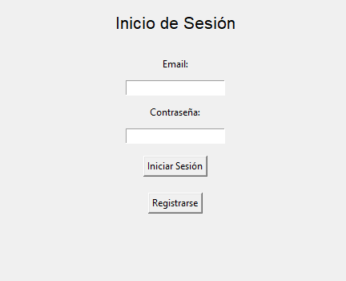
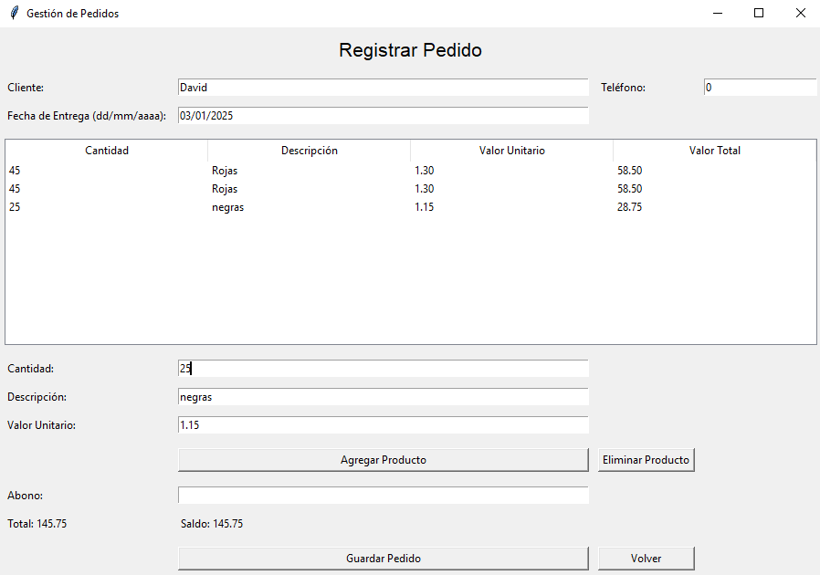

# Gestor de Pedidos 📝
Esta es una aplicación de escritorio diseñada para pequeños negocios o emprendedores que necesitan gestionar sus pedidos de manera eficiente. Permite gestionar pedidos, generar el pedido en formato PDF y realizar un seguimiento del estado de cada pedido.

# Características 🔧 
Desarrollada en Python con una interfaz gráfica (usando Tkinter) y un backend basado en Supabase.

**Gestión de Pedidos:**

- Registro de cliente, teléfono, fecha de entrega y productos.
- Cálculo automático de totales, abonos y saldos.
- Generación de pedidos en formato PDF.

**Lista de Pedidos:**

- Visualización de pedidos registrados con detalles como cliente, fecha de entrega y estado.
- Posibilidad de marcar un pedido como "Listo".
- Apertura directa del PDF generado para cada pedido.

**Inicio de Sesión:**

- Autenticación de usuarios mediante Supabase.
- Seguridad y gestión de usuarios integrada.

## Vista Previa 👀

    
    
    

## Requisitos ✅

Supabase (configurado como backend para usuarios, pedidos y almacenamiento de PDFs)

- Crear las Tablas necesarias
- Crear un Bucket de Almacenamiento:
- Configurar credenciales: Supabase URL y la API Key 

Para la versión en Python:
- Debes tener Python instalado si deseas ejecutar el código fuente.
- Python 3.8 o superior.
- Las siguientes dependencias de Python:
  - `tkinter` (para la interfaz gráfica).
  - `reportlab` (para generar PDFs).
  - `supabase-py` (para conexión con Supabase).
  - `tkcalendar` (opcional, para el selector de fechas).
  - `webbrowser` (para abrir PDFs desde el navegador).

Para la versión ejecutable (`.exe`):
- No es necesario tener Python instalado.

## Instalación y Ejecución 🛠️

***Opción 1***: Ejecutar desde el código fuente
- Clona el **repositorio**.
- Instala las dependencias
- Abre el código **app.py** en tu editor de texto o IDE favorito.
- Ejecuta el programa con **Python**.

***Opción 2***: Descargar el archivo ejecutable ⬇️
- Dirígete a la sección **dist** del proyecto.
- Descarga el archivo **app.exe** disponible.
- Haz doble clic sobre el archivo **app.exe** para iniciar la app.

## Contacto 📞
Si tienes preguntas o sugerencias, no dudes en contactar:

Autor: David Alvarez

Email: playdacid@gmail.com
